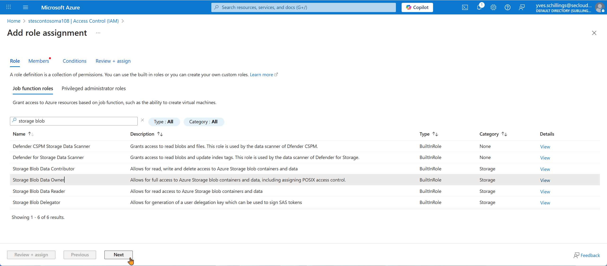
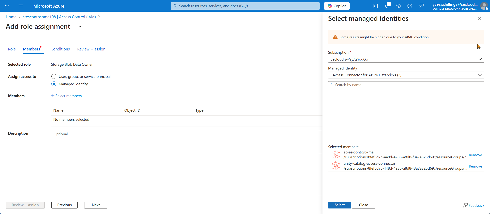
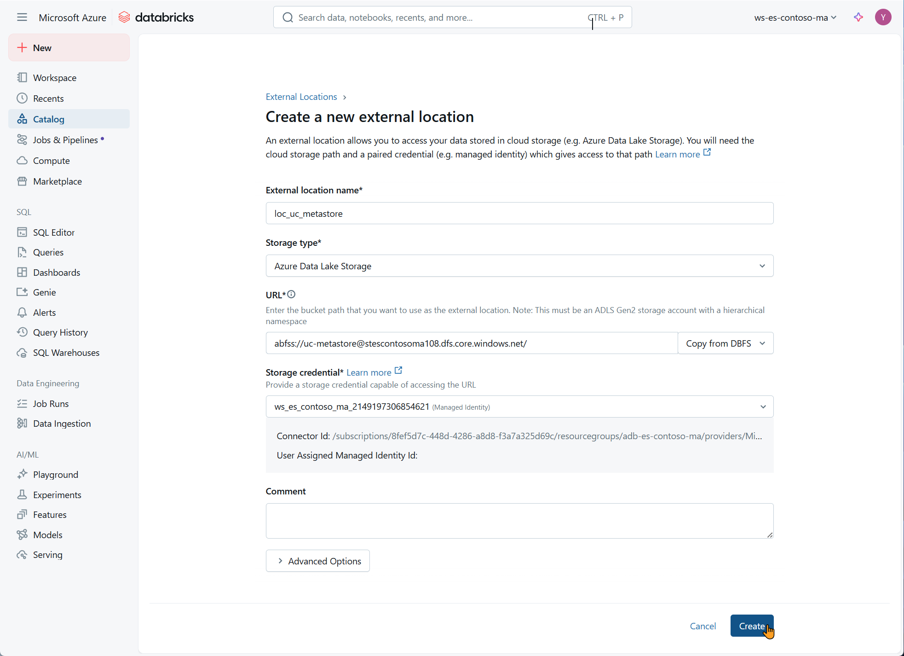

# Getting Started — Azure Databricks and Microsoft Fabric (Free/Trial)

This guide shows how to create an Azure Databricks workspace (Premium Trial, 14 days) and enable Microsoft Fabric (Trial or Free F2), configure both for this M&A project, and understand what's possible on free/trial tiers. It also includes quick starts per role (DE/DS/DA).

Useful links: [Glossary](GLOSSARY.md), [Backlog](statement/eurostyle-contonso-ma-project-backlog.md), [Certification-compliant use case](statement/eurostyle-contonso-ma-certification-compliant.md).

---

## 1) Create Azure Databricks — Premium Trial

### Prerequisites (before you start)
- Azure subscription; role Owner/Contributor on the subscription or target resource group.
- Microsoft Entra ID account in the tenant.
- Optional admin tasks (for Unity Catalog later): ability to create a storage account and grant roles.
- Docs hub: https://learn.microsoft.com/azure/databricks/

### Steps (Azure Portal) 
1) Resource group
- Azure Portal → Resource groups → Create
- Name: `rg-es-contoso-ma` (M&A emphasis)
- Region: same region you plan to use for Databricks (e.g., France Central)

2) Databricks workspace
- Create a resource → search "Azure Databricks" → Create
- Basics:
  - Subscription: select yours
  - Resource group: `rg-es-contoso-ma`
  - Workspace name: `ws-es-contoso-ma`
  - Region: same as the resource group (keep data locality)
  - Pricing Tier: Trial (Premium — 14 days Free DBUs)
- Review + create → after deployment, Open and Launch Workspace
- Reference: Getting started → Create workspace: https://learn.microsoft.com/azure/databricks/getting-started/

  

  

  

### Minimal workspace configuration

- Connect to GitHub repository : [runbook/databricks-github-folder-repo-commit-push.md](./docs/runbooks/databricks-github-folder-repo-commit-push.md)
- Notebooks

- Compute (cluster)
  - Create → Compute → New cluster
  - Runtime: a recent LTS (stable)
  - Size: small (1 driver + 1 worker)
  - Auto-termination: 15–30 minutes
  - Docs: https://learn.microsoft.com/azure/databricks/compute/create-cluster

  

  

  

#### Connect to GitHub repository

Use this runbook to generate a PAT, link GitHub, create/clone the Git folder under /Repos, and perform your first commit & push.
  - [Runbook — Databricks & GitHub (setup, git folder, commit & push)](./docs/runbooks/databricks-github-folder-repo-commit-push.md)
  
#### SQL Warehouse (for Databricks SQL dashboards)

Create this once early (Sprint 1, detailed in Feature 1.1) and reuse it across:
- Feature 1.1 (DirectQuery smoke test on Bronze)
- Feature 3.1 (First Look dashboard)
- Features 3.2 / 3.3 (Raw vs Silver, Executive dashboard)
- Governance G.1 (Purview / Unity Catalog scans if UC enabled)

Document the Hostname and HTTP Path (from the warehouse details) in the README under a short "Connectivity – Power BI / DirectQuery" section so analysts/scientists can connect without asking engineering. Keep it small, auto‑stop aggressively (15–30 min) to control trial costs.

  - Switch to SQL persona → Warehouses → New → choose Pro/Classic if Serverless is unavailable in your region
  - Size: small; Auto-stop: 15–30 minutes
  - Docs: https://learn.microsoft.com/azure/databricks/compute/sql-warehouse/create (Create & manage SQL warehouses)
- Optional — Unity Catalog (governed naming and RLS/CLS later)
  - If you're Account Admin: create a UC Metastore (Account Console), attach this workspace, and create an External Location (backed by ADLS Gen2 with a managed identity that has Storage Blob Data Contributor)
  - Docs (overview): https://learn.microsoft.com/azure/databricks/data-governance/unity-catalog/
  - If you can't enable UC on trial, use `hive_metastore` and simulate RLS in views or enforce RLS in Power BI

#### Unity Catalog setup — storage account & access connector (optional but recommended for a fuller governance study experience)
These steps sit outside the minimal trial path. Do them if you want realistic governance (catalogs), cleaner lineage, and fine‑grained security scenarios.

##### 1) Storage account (ADLS Gen2)
  - Azure Portal → Create resource → Storage account

  - Name: `stescontosoma` (lowercase, 3–24 chars, letters & numbers only; no dashes or underscores; globally unique)
  - Region: same as workspace (e.g., France Central)
  - Performance: Standard; Redundancy: LRS
  

  - Advanced: Enable Hierarchical namespace

 

  - Create → then inside the storage account create containers:

  

  

  - Containers (suggested logical zones):
    - `unity-catalog` – Unity Catalog managed tables / metastore-related data (if used)
    - `raw` – optional pre-bronze dump (exact source file copies before any normalization)
    - `bronze` – raw ingested landing zone (minimal transformation)
    - `silver` – cleaned & conformed data (deduped, typed, harmonized)
    - `gold` – curated marts / analytics-ready aggregates

    - `monitor` – quality & operational metrics (DQ checks, pipeline run logs, churn/model metrics exports)

  - `chk` – (optional) checkpoint/state isolation. You can keep streaming/Autoloader `_checkpoint` folders inside each zone instead of a container; we create a dedicated container here for clarity & easy lifecycle cleanup.

  

**Upload data files into `raw`**

Create two folders inside `raw` (landing area for ingested files):
- `eurostyle` 
- `contoso`

Upload in 
- `eurostyle`  the files in `data/source/eurostyle` from this repo (CSV files).
- `contoso` the files   in `data/source/contoso` from this repo (csv file).  

  
 

  
  
  
  

##### 2) Azure Databricks Access Connector
  - Create resource → "Azure Databricks access connector"

 

  

  - Name: `ac-es-contonso-ma` (same RG & region)
  - Identity: System assigned
  - Create an Access Connector for Azure Databricks

   

##### 3) Grant connector access to storage
  - Storage account → Access control (IAM) → Add role assignment

  
  - Role: Storage Blob Data Owner (simplest) — or Storage Blob Data Contributor for least privilege

 

  - Assign access to: Managed identity → select `ac-es-contonso-ma` → Save

  
  
#### Assigning a Catalog to Workspaces in Databricks

In Unity Catalog, a catalog is a top-level container that organizes schemas and tables. By default, a catalog is created at the account level, but workspaces cannot access it until it is explicitly assigned.

**Why this step is necessary**
- Each workspace in Databricks operates in isolation unless you grant it permissions.
- Assigning a catalog to a workspace ensures that users in that workspace can see and use the catalog's objects (schemas, tables, views).
- Without this assignment, the catalog will remain inaccessible, even if the workspace is linked to the same Unity Catalog metastore.

**What is being done in the screenshots**
1. In the Catalog Explorer, the catalog `ws_es_contoso_ma` is shown as "No access".
2. The administrator clicks Assign to workspaces.
3. The list of available workspaces is displayed. Here, the workspace ws-es-contoso-ma is selected.
4. Clicking Assign grants this workspace the ability to access the catalog.
5. The catalog now becomes available inside the workspace, and its objects can be created and queried.

**Key point**

This step links the account-level catalog to the workspace. Without this linkage, users inside the workspace cannot create or query objects in the catalog, even if they have the correct permissions.

  

  

#### Bootstrapping the Databricks Account Console (when no Account Admin exists)

##### Symptoms

In the workspace UI there is no "Manage account / Account Console" button.

Trying to open the Account Console shows: "The Microsoft Entra tenant … does not belong to any Databricks account."

Your main identity (e.g., yves.schillings@secloudis.com) appears as a Guest in the tenant that owns the subscription.

##### Why this happens

**Databricks Account Console** sits **above workspaces**. The very first time an Entra tenant is linked to a Databricks account, only a Microsoft Entra Global Administrator (or an existing Databricks Account admin) can sign in and create that account.
If your everyday user is a **Guest** in the subscription's directory, it can create a workspace but **cannot bootstrap the Account Console**.

##### One-time bootstrap

Created a temporary internal user in the subscription's directory with Global Admin, used it once to create the Databricks account, then granted Account Admin to the real user.

**Steps**

##### Create an internal admin user
Azure Portal → Microsoft Entra ID (the Default Directory that owns the subscription) → Users → New user

- UPN: adb-admin@<your_tenant>.onmicrosoft.com
- Display name: Databricks Admin

Assign role: Global Administrator (Roles and administrators → Global Administrator → Add assignment)

  

##### Sign in to the Account Console once
Go to https://accounts.azuredatabricks.net and sign in with adb-admin@….
This creates the Databricks Account for the tenant and makes this user Account admin.

  

##### Grant your real user Account Admin
Account Console → User management → Add user → add yves.schillings@secloudis.com → toggle Account admin.

  

  

##### Open the Databricks Account Console from a workspace

- In any Azure Databricks workspace:
- Go to the top-right header and click the workspace selector (it shows your current workspace name, e.g. ws-es-contoso-ma).
- Click Manage account (see screenshot). This opens the Databricks Account Console in a new tab.

  

  

##### (Optional) Reduce privileges / clean-up

- Remove Global Administrator from adb-admin@…, or disable the account, or keep it as a break-glass account protected with MFA/PIM and a strong, vaulted password.

- After this bootstrap, continue with Unity Catalog setup: create the Metastore (France Central), Storage credential (via Access Connector), External location (your unity-catalog container), and attach the workspace to the metastore.

##### Security notes

- Use MFA for any account with elevated rights.
- Prefer PIM (just-in-time Global Admin) if available.
- Keep the principle of least privilege—remove GA from the temporary user after setup.

##### 4) Create Metastore & External Location (requires Account Admin)
> **No "Manage account" button visible?**  
> Then you are not an Account Admin (common with a personal trial). Skip the Unity Catalog steps below and use the fallback: create the `raw|bronze|silver|gold|monitor|ref` databases in `hive_metastore` (SQL block provided) and continue. You can enable Unity Catalog later without redoing earlier features.
  
  - If you do NOT see a "Manage Account" (or "Account Console") option in the top‑right user/avatar menu inside the workspace, you are not an Account Admin. Options:
    - Ask an existing Account Admin to grant you the Account Admin role (Account Console → User management → add user → assign role) so you can perform steps 4–5 or follow the steps explained above **Bootstrapping the Databricks Account Console (when no Account Admin exists)**

  

  - Direct URL (if you are an admin): https://accounts.azuredatabricks.net  (sign‑in failure or 403 means you lack account privileges.)

  

  

  

  - Open the Databricks Account Console (NOT the workspace UI) → left menu "Catalog" ("Unity Catalog") → Create Metastore (give it a name and region matching the workspace)

  

    - Or skip steps 4–5 and continue using `hive_metastore`. To simulate governance without UC: (1) create schemas named `raw`, `bronze`, `silver`, `gold`, `monitor`, `ref`; (2) enforce row filters via SQL views; (3) document access rules manually.

  - Create an External Location pointing to the container path, e.g.: `abfss://unity-catalog@stes-es-contonso-ma.dfs.core.windows.net/`
  - Grant privileges (USE CATALOG / CREATE / SELECT as needed) to relevant groups (e.g., `data_engineers`, `analysts`)
  - (If you used a different container name, adjust the URI accordingly)

###### Detail: Create External Location for Unity Catalog Metastore

To enable Unity Catalog to store and manage metadata in Azure Data Lake Storage Gen2 (ADLS Gen2), you must create an External Location. This binds the storage path (for example: `abfss://uc-metastore@<your-storage-account>.dfs.core.windows.net/`) to a Storage Credential (typically a Managed Identity or Service Principal) that has permission to access the underlying storage.

This step is required to ensure that Unity Catalog can securely read and write metadata files (such as schema definitions, managed tables, and permission records) in the ADLS Gen2 container.

**Instructions**

1. In the Databricks workspace, go to the left navigation pane and open **Catalog > External Locations**.
2. Click **Create**.
3. Fill in the following fields:
   - **External location name**: for example, `loc_uc_metastore`
   - **Storage type**: select `Azure Data Lake Storage`
   - **URL**: use the format `abfss://<container>@<storage-account>.dfs.core.windows.net/`
   - **Storage credential**: select the Managed Identity or Service Principal configured during the Unity Catalog setup
4. Click **Create** to save the external location.
5. Once created, click **Test connection** to verify that all required permissions (read, write, list, delete) are correctly assigned.

If the test passes with all permissions confirmed, the external location is now ready and can be used by the Unity Catalog metastore to manage metadata securely.

  

  

##### 5) Attach workspace to Metastore
  - Account Console → Workspaces → select workspace → Attach Metastore

  

Notes
  - If blocked (trial restrictions) fallback to `hive_metastore` and continue.
  - UC improves lineage & privilege granularity; cost hygiene still relies on auto-stop.
  - Consistent naming (`es-contonso-ma`) simplifies future automation scripts.

Collect connection info (for Power BI or external SQL clients)
- In SQL persona → Warehouses → your warehouse → Copy "Server hostname" and "HTTP Path"
- You'll use these in the Power BI Databricks connector
- Docs (Power BI ↔ Databricks): https://learn.microsoft.com/azure/databricks/partners/bi/power-bi (overview & connector setup)

Trial hygiene and cost control
- Enable auto-stop on clusters and warehouses; shut them down when idle
- Prefer a single small cluster for notebooks and a small SQL warehouse for dashboards
- Keep your workspace files under `/Workspace/Users/<you>/es-contoso/`

Quotas and common issues
- If you hit regional quota when creating compute: try a smaller VM family or another nearby region
- Serverless SQL not offered: select Pro/Classic
- Model Serving not available on trial: use scheduled batch scoring instead

---

## 2) Enable Microsoft Fabric — Trial or Free (F2)

Prereqs
- A Power BI account in your tenant (https://app.powerbi.com) with permission to create workspaces.
- For capacity assignment: Fabric/Power BI admin or a user with rights to create Trial workspaces.

### Option A — Fabric Trial (recommended)
#### 1) Start the trial
- Go to Power BI Service: https://app.powerbi.com
- Click Try Fabric (top banner or settings) and follow the prompts.
- Docs: https://learn.microsoft.com/fabric/get-started/fabric-trial

#### 2) Create a Fabric workspace on Trial capacity
- Workspaces → New workspace → Name: `es-contoso-ma` (M&A emphasis)
- Advanced → Capacity: select your Fabric Trial capacity
- Save
- Docs: https://learn.microsoft.com/fabric/enterprise/capacity#workspaces-and-capacities

#### 3) Create the core items
- Lakehouse: New → Lakehouse → name `lh-es-contoso-ma`
  - Docs: https://learn.microsoft.com/fabric/lakehouse/
- Data Warehouse (optional for T‑SQL): New → Warehouse → `wh-es-contoso-ma`
  - Docs: https://learn.microsoft.com/fabric/data-warehouse/
- Semantic model + Report (Power BI): build a model and report from Lakehouse/Warehouse tables
  - RLS guidance: https://learn.microsoft.com/power-bi/enterprise/row-level-security
- Deployment Pipeline (Dev→Test): Create pipeline → assign your workspace as Dev → clone to Test
  - Docs: https://learn.microsoft.com/fabric/cicd/deployment-pipelines/overview

### Option B — Fabric Free (F2)
- If you skip the trial, you operate on shared Free (F2) capacity with lower limits and feature restrictions.
- Create a new workspace (as above). If capacity cannot be assigned, it runs on shared capacity automatically.
- Many learning tasks still work; some features like Direct Lake and Deployment Pipelines may be unavailable or constrained.

Typical items to create (with docs)
- Lakehouse (files + tables): https://learn.microsoft.com/fabric/lakehouse/
- Warehouse (T‑SQL): https://learn.microsoft.com/fabric/data-warehouse/
- Semantic model (dataset) + Report (Power BI): https://learn.microsoft.com/power-bi/create-reports/
- Data Pipelines (ingestion/orchestration): https://learn.microsoft.com/fabric/data-factory/pipelines-overview
- OneLake Shortcuts (zero‑copy to ADLS): https://learn.microsoft.com/fabric/onelake/onelake-shortcuts

Notes and tips
- Direct Lake prerequisites/caveats: https://learn.microsoft.com/power-bi/enterprise/directlake-overview
- If you can't use Direct Lake, use Import or DirectQuery connectors.
- For M&A clarity, keep item names consistent (lh‑/wh‑/model‑/report‑es‑contoso‑ma).

---

## 3) What you can and can't do on Free/Trial

Azure Databricks (Trial) — works
- Delta Lake: Bronze→Silver→Gold, MERGE, OPTIMIZE, VACUUM, time travel
- Databricks SQL: queries, Lakeview dashboards, alerts (with a running warehouse)
- Jobs/Workflows: schedule notebooks/SQL tasks
- MLflow: experiments/runs; basic registry

Azure Databricks — caveats/fallbacks
- Unity Catalog: works if you can create the Metastore + External Location; otherwise use `hive_metastore`.
- Delta Live Tables (DLT): may be restricted → fallback to Jobs + notebooks.
- Model Serving: may be unavailable → fallback to scheduled batch scoring.
- Serverless SQL Warehouse: region-dependent → use Pro/Classic.

Microsoft Fabric (Trial) — works
- Lakehouse, Warehouse, Direct Lake (capacity-dependent), Data Pipelines, Deployment Pipelines
- Sensitivity labels, RLS in the semantic model

Microsoft Fabric (Free/F2) — limits
- Small capacity; some features reduced or unavailable (e.g., Direct Lake, Pipelines)
- Alternatives: Power BI Desktop Import, or DirectQuery to Databricks

Out of scope for free/trial
- Private networking (VNET/Private Link), advanced SSO, enterprise governance/SLA

---

## 4) Databricks → Fabric handover (minimal flow)
1. Prepare Gold tables (Delta/Parquet) in Databricks.
2. Prefer Shortcut (zero-copy) from Fabric Lakehouse to the ADLS folder.
3. If Shortcut is blocked by RBAC/network/tenant/region, export Parquet (+ manifest) and ingest with a Fabric Data Pipeline.
4. Build a semantic model (star schema, named DAX measures, RLS) and a Power BI report.
5. On Trial, promote via a Deployment Pipeline (Dev→Test).

Shortcut vs Export — decision box
- Use Shortcut when: same tenant, RBAC in place (Storage Blob Data Reader), networking allows access, near-real-time read-only is fine.
- Use Export when: you need an immutable snapshot, tenant/region boundaries or networking constraints exist, or you want fully-managed performance under Fabric capacity.

---

## 5) Role quick starts (Epics + Features)

Epics overview (what each epic delivers)
- [Epic 1 — Data Foundation Platform](statement/eurostyle-contonso-ma-project-backlog.md#epic-1): ingest, clean, and curate data in the Medallion architecture (Bronze → Silver → Gold).
- [Epic 2 — ML & Predictive](statement/eurostyle-contonso-ma-project-backlog.md#epic-2): exploratory analysis, feature engineering, model training, and batch scoring.
- [Epic 3 — Analytics & BI](statement/eurostyle-contonso-ma-project-backlog.md#epic-3): business KPIs, semantic modeling, reports, and security (RLS).
- [Epic 4 — Platform Integration](statement/eurostyle-contonso-ma-project-backlog.md#epic-4): handoff to Microsoft Fabric (Lakehouse/Warehouse), pipelines, and promotion.

### Data Engineer (DE)
- Sprint 1 — [Epic 1](statement/eurostyle-contonso-ma-project-backlog.md#epic-1) ([Feature 1.1](statement/eurostyle-contonso-ma-project-backlog.md#feature-1-1)): Bronze ingestion → Delta tables with lineage
- Sprint 2 — [Epic 1](statement/eurostyle-contonso-ma-project-backlog.md#epic-1) ([Feature 1.2](statement/eurostyle-contonso-ma-project-backlog.md#feature-1-2)): Silver cleaning → dedup, FX→EUR, idempotent writes
- Sprint 3 — [Epic 1](statement/eurostyle-contonso-ma-project-backlog.md#epic-1) ([Feature 1.3](statement/eurostyle-contonso-ma-project-backlog.md#feature-1-3)): Gold marts → `sales_daily`, `category_perf`, `customer_360`
- Sprint 4 — [Epic 4](statement/eurostyle-contonso-ma-project-backlog.md#epic-4) (Integration): Export to Fabric via Shortcut or Parquet + manifest

Implementation details for the initial ingestion, SQL warehouse setup, DirectQuery connectivity, and documentation steps are explained in [Feature 1.1](statement/eurostyle-contonso-ma-project-backlog.md#feature-1-1).

### Data Scientist (DS)
- Sprint 1 — [Epic 2](statement/eurostyle-contonso-ma-project-backlog.md#epic-2) ([Feature 2.1](statement/eurostyle-contonso-ma-project-backlog.md#feature-2-1)): EDA, baselines, MLflow setup
- Sprint 2 — [Epic 2](statement/eurostyle-contonso-ma-project-backlog.md#epic-2) ([Feature 2.2](statement/eurostyle-contonso-ma-project-backlog.md#feature-2-2)): Feature engineering (RFM, overlap), versioned tables/contracts
- Sprint 3 — [Epic 2](statement/eurostyle-contonso-ma-project-backlog.md#epic-2) ([Feature 2.3](statement/eurostyle-contonso-ma-project-backlog.md#feature-2-3)): Train and register models (churn, CLV)
- Sprint 4 — [Epic 2](statement/eurostyle-contonso-ma-project-backlog.md#epic-2) + [Epic 4](statement/eurostyle-contonso-ma-project-backlog.md#epic-4) ([Feature 2.4](statement/eurostyle-contonso-ma-project-backlog.md#feature-2-4)): Batch scoring and join into Gold `customer_360`, then export with DE

### Data Business Analyst (DA)
- Sprint 1 — [Epic 3](statement/eurostyle-contonso-ma-project-backlog.md#epic-3) ([Feature 3.1](statement/eurostyle-contonso-ma-project-backlog.md#feature-3-1)): First Look via Databricks SQL (DirectQuery) or Power BI
- Sprint 2 — [Epic 3](statement/eurostyle-contonso-ma-project-backlog.md#epic-3) ([Feature 3.2](statement/eurostyle-contonso-ma-project-backlog.md#feature-3-2)): Raw vs Silver comparison; draft RLS
- Sprint 3 — [Epic 3](statement/eurostyle-contonso-ma-project-backlog.md#epic-3) ([Feature 3.3](statement/eurostyle-contonso-ma-project-backlog.md#feature-3-3)): Executive Post‑Merger dashboard
- Sprint 4 — [Epic 3](statement/eurostyle-contonso-ma-project-backlog.md#epic-3) + [Epic 4](statement/eurostyle-contonso-ma-project-backlog.md#epic-4) ([Feature 4.2](statement/eurostyle-contonso-ma-project-backlog.md#feature-4-2)): Power BI Suite and Deployment Pipeline (Dev→Test)
## 6) References
- Backlog: [statement/eurostyle-contonso-ma-project-backlog.md](statement/eurostyle-contonso-ma-project-backlog.md)
- Solutions: https://github.com/yves-schillings/eurostyle-contonso-ma-unified-data-ai-databricks-fabric-sol/tree/main/solution
- Certification-compliant use case: [statement/eurostyle-contonso-ma-certification-compliant.md](statement/eurostyle-contonso-ma-certification-compliant.md)
- Certification guides: [certification/](certification/)
- Glossary: [GLOSSARY.md](GLOSSARY.md)

---
 Additional resource: [secloudis.com](https://secloudis.com) – articles and notes on cloud, data, analytics, and artificial intelligence (optional external reference).

