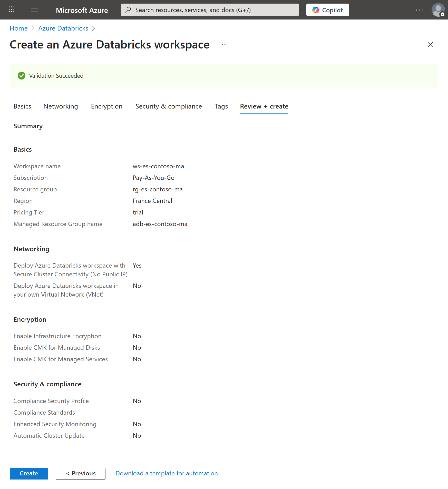

# Getting Started — Azure Databricks and Microsoft Fabric (Free/Trial)

This guide shows how to create an Azure Databricks workspace (Premium Trial, 14 days) and enable Microsoft Fabric (Trial or Free F2), configure both for this M&A project, and understand what's possible on free/trial tiers. It also includes quick starts per role (DE/DS/DA).

Useful links: [Glossary](GLOSSARY.md), [Backlog](statement/eurostyle-contonso-ma-project-backlog.md), [Certification-compliant use case](statement/eurostyle-contonso-ma-certification-compliant.md).

---

## 1) Create Azure Databricks — Premium Trial

### Prerequisites (before you start)
- Azure subscription; role Owner/Contributor on the subscription or target resource group.
- Microsoft Entra ID account in the tenant.
- Optional admin tasks (for Unity Catalog later): ability to create a storage account and grant roles.
- Docs hub: https://learn.microsoft.com/azure/databricks/

### Steps (Azure Portal) 
1) Resource group
- Azure Portal → Resource groups → Create
- Name: `rg-es-contoso-ma` (M&A emphasis)
- Region: same region you plan to use for Databricks (e.g., France Central)

2) Databricks workspace
- Create a resource → search "Azure Databricks" → Create
- Basics:
  - Subscription: select yours
  - Resource group: `rg-es-contoso-ma`
  - Workspace name: `ws-es-contoso-ma`
  - Region: same as the resource group (keep data locality)
  - Pricing Tier: Trial (Premium — 14 days Free DBUs)
- Review + create → after deployment, Open and Launch Workspace
- Reference: Getting started → Create workspace: https://learn.microsoft.com/azure/databricks/getting-started/

  

  

  

### Minimal workspace configuration

- Connect to GitHub repository : [runbook/databricks-github-folder-repo-commit-push.md](./docs/runbooks/databricks-github-folder-repo-commit-push.md)
- Notebooks

- Compute (cluster)
  - Create → Compute → New cluster
  - Runtime: a recent LTS (stable)
  - Size: small (1 driver + 1 worker)
  - Auto-termination: 15–30 minutes
  - Docs: https://learn.microsoft.com/azure/databricks/compute/create-cluster

  

  

  

#### Connect to GitHub repository

Use this runbook to generate a PAT, link GitHub, create/clone the Git folder under /Repos, and perform your first commit & push.
  - [Runbook — Databricks & GitHub (setup, git folder, commit & push)](./docs/runbooks/databricks-github-folder-repo-commit-push.md)
  
#### SQL Warehouse (for Databricks SQL dashboards)

Create this once early (Sprint 1, detailed in Feature 1.1) and reuse it across:
- Feature 1.1 (DirectQuery smoke test on Bronze)
- Feature 3.1 (First Look dashboard)
- Features 3.2 / 3.3 (Raw vs Silver, Executive dashboard)
- Governance G.1 (Purview / Unity Catalog scans if UC enabled)

Document the Hostname and HTTP Path (from the warehouse details) in the README under a short "Connectivity – Power BI / DirectQuery" section so analysts/scientists can connect without asking engineering. Keep it small, auto‑stop aggressively (15–30 min) to control trial costs.

  - Switch to SQL persona → Warehouses → New → choose Pro/Classic if Serverless is unavailable in your region
  - Size: small; Auto-stop: 15–30 minutes
  - Docs: https://learn.microsoft.com/azure/databricks/compute/sql-warehouse/create (Create & manage SQL warehouses)
- Optional — Unity Catalog (governed naming and RLS/CLS later)
  - If you're Account Admin: create a UC Metastore (Account Console), attach this workspace, and create an External Location (backed by ADLS Gen2 with a managed identity that has Storage Blob Data Contributor)
  - Docs (overview): https://learn.microsoft.com/azure/databricks/data-governance/unity-catalog/
  - If you can't enable UC on trial, use `hive_metastore` and simulate RLS in views or enforce RLS in Power BI

Collect connection info (for Power BI or external SQL clients)
- In SQL persona → Warehouses → your warehouse → Copy "Server hostname" and "HTTP Path"
- You'll use these in the Power BI Databricks connector
- Docs (Power BI ↔ Databricks): https://learn.microsoft.com/azure/databricks/partners/bi/power-bi (overview & connector setup)

Trial hygiene and cost control
- Enable auto-stop on clusters and warehouses; shut them down when idle
- Prefer a single small cluster for notebooks and a small SQL warehouse for dashboards
- Keep your workspace files under `/Workspace/Users/<you>/es-contoso/`

Quotas and common issues
- If you hit regional quota when creating compute: try a smaller VM family or another nearby region
- Serverless SQL not offered: select Pro/Classic
- Model Serving not available on trial: use scheduled batch scoring instead

---

## 2) Enable Microsoft Fabric — Trial or Free (F2)

Prereqs
- A Power BI account in your tenant (https://app.powerbi.com) with permission to create workspaces.
- For capacity assignment: Fabric/Power BI admin or a user with rights to create Trial workspaces.

### Option A — Fabric Trial (recommended)
#### 1) Start the trial
- Go to Power BI Service: https://app.powerbi.com
- Click Try Fabric (top banner or settings) and follow the prompts.
- Docs: https://learn.microsoft.com/fabric/get-started/fabric-trial

#### 2) Create a Fabric workspace on Trial capacity
- Workspaces → New workspace → Name: `es-contoso-ma` (M&A emphasis)
- Advanced → Capacity: select your Fabric Trial capacity
- Save
- Docs: https://learn.microsoft.com/fabric/enterprise/capacity#workspaces-and-capacities

#### 3) Create the core items
- Lakehouse: New → Lakehouse → name `lh-es-contoso-ma`
  - Docs: https://learn.microsoft.com/fabric/lakehouse/
- Data Warehouse (optional for T‑SQL): New → Warehouse → `wh-es-contoso-ma`
  - Docs: https://learn.microsoft.com/fabric/data-warehouse/
- Semantic model + Report (Power BI): build a model and report from Lakehouse/Warehouse tables
  - RLS guidance: https://learn.microsoft.com/power-bi/enterprise/row-level-security
- Deployment Pipeline (Dev→Test): Create pipeline → assign your workspace as Dev → clone to Test
  - Docs: https://learn.microsoft.com/fabric/cicd/deployment-pipelines/overview

### Option B — Fabric Free (F2)
- If you skip the trial, you operate on shared Free (F2) capacity with lower limits and feature restrictions.
- Create a new workspace (as above). If capacity cannot be assigned, it runs on shared capacity automatically.
- Many learning tasks still work; some features like Direct Lake and Deployment Pipelines may be unavailable or constrained.

Typical items to create (with docs)
- Lakehouse (files + tables): https://learn.microsoft.com/fabric/lakehouse/
- Warehouse (T‑SQL): https://learn.microsoft.com/fabric/data-warehouse/
- Semantic model (dataset) + Report (Power BI): https://learn.microsoft.com/power-bi/create-reports/
- Data Pipelines (ingestion/orchestration): https://learn.microsoft.com/fabric/data-factory/pipelines-overview
- OneLake Shortcuts (zero‑copy to ADLS): https://learn.microsoft.com/fabric/onelake/onelake-shortcuts

Notes and tips
- Direct Lake prerequisites/caveats: https://learn.microsoft.com/power-bi/enterprise/directlake-overview
- If you can't use Direct Lake, use Import or DirectQuery connectors.
- For M&A clarity, keep item names consistent (lh‑/wh‑/model‑/report‑es‑contoso‑ma).

---

## 3) What you can and can't do on Free/Trial

Azure Databricks (Trial) — works
- Delta Lake: Bronze→Silver→Gold, MERGE, OPTIMIZE, VACUUM, time travel
- Databricks SQL: queries, Lakeview dashboards, alerts (with a running warehouse)
- Jobs/Workflows: schedule notebooks/SQL tasks
- MLflow: experiments/runs; basic registry

Azure Databricks — caveats/fallbacks
- Unity Catalog: works if you can create the Metastore + External Location; otherwise use `hive_metastore`.
- Delta Live Tables (DLT): may be restricted → fallback to Jobs + notebooks.
- Model Serving: may be unavailable → fallback to scheduled batch scoring.
- Serverless SQL Warehouse: region-dependent → use Pro/Classic.

Microsoft Fabric (Trial) — works
- Lakehouse, Warehouse, Direct Lake (capacity-dependent), Data Pipelines, Deployment Pipelines
- Sensitivity labels, RLS in the semantic model

Microsoft Fabric (Free/F2) — limits
- Small capacity; some features reduced or unavailable (e.g., Direct Lake, Pipelines)
- Alternatives: Power BI Desktop Import, or DirectQuery to Databricks

Out of scope for free/trial
- Private networking (VNET/Private Link), advanced SSO, enterprise governance/SLA

---

## 4) Databricks → Fabric handover (minimal flow)
1. Prepare Gold tables (Delta/Parquet) in Databricks.
2. Prefer Shortcut (zero-copy) from Fabric Lakehouse to the ADLS folder.
3. If Shortcut is blocked by RBAC/network/tenant/region, export Parquet (+ manifest) and ingest with a Fabric Data Pipeline.
4. Build a semantic model (star schema, named DAX measures, RLS) and a Power BI report.
5. On Trial, promote via a Deployment Pipeline (Dev→Test).

Shortcut vs Export — decision box
- Use Shortcut when: same tenant, RBAC in place (Storage Blob Data Reader), networking allows access, near-real-time read-only is fine.
- Use Export when: you need an immutable snapshot, tenant/region boundaries or networking constraints exist, or you want fully-managed performance under Fabric capacity.

---

## 5) Role quick starts (Epics + Features)

Epics overview (what each epic delivers)
- [Epic 1 — Data Foundation Platform](statement/eurostyle-contonso-ma-project-backlog.md#epic-1): ingest, clean, and curate data in the Medallion architecture (Bronze → Silver → Gold).
- [Epic 2 — ML & Predictive](statement/eurostyle-contonso-ma-project-backlog.md#epic-2): exploratory analysis, feature engineering, model training, and batch scoring.
- [Epic 3 — Analytics & BI](statement/eurostyle-contonso-ma-project-backlog.md#epic-3): business KPIs, semantic modeling, reports, and security (RLS).
- [Epic 4 — Platform Integration](statement/eurostyle-contonso-ma-project-backlog.md#epic-4): handoff to Microsoft Fabric (Lakehouse/Warehouse), pipelines, and promotion.

### Data Engineer (DE)
- Sprint 1 — [Epic 1](statement/eurostyle-contonso-ma-project-backlog.md#epic-1) ([Feature 1.1](statement/eurostyle-contonso-ma-project-backlog.md#feature-1-1)): Bronze ingestion → Delta tables with lineage
- Sprint 2 — [Epic 1](statement/eurostyle-contonso-ma-project-backlog.md#epic-1) ([Feature 1.2](statement/eurostyle-contonso-ma-project-backlog.md#feature-1-2)): Silver cleaning → dedup, FX→EUR, idempotent writes
- Sprint 3 — [Epic 1](statement/eurostyle-contonso-ma-project-backlog.md#epic-1) ([Feature 1.3](statement/eurostyle-contonso-ma-project-backlog.md#feature-1-3)): Gold marts → `sales_daily`, `category_perf`, `customer_360`
- Sprint 4 — [Epic 4](statement/eurostyle-contonso-ma-project-backlog.md#epic-4) (Integration): Export to Fabric via Shortcut or Parquet + manifest

Implementation details for the initial ingestion, SQL warehouse setup, DirectQuery connectivity, and documentation steps are explained in [Feature 1.1](statement/eurostyle-contonso-ma-project-backlog.md#feature-1-1).

### Data Scientist (DS)
- Sprint 1 — [Epic 2](statement/eurostyle-contonso-ma-project-backlog.md#epic-2) ([Feature 2.1](statement/eurostyle-contonso-ma-project-backlog.md#feature-2-1)): EDA, baselines, MLflow setup
- Sprint 2 — [Epic 2](statement/eurostyle-contonso-ma-project-backlog.md#epic-2) ([Feature 2.2](statement/eurostyle-contonso-ma-project-backlog.md#feature-2-2)): Feature engineering (RFM, overlap), versioned tables/contracts
- Sprint 3 — [Epic 2](statement/eurostyle-contonso-ma-project-backlog.md#epic-2) ([Feature 2.3](statement/eurostyle-contonso-ma-project-backlog.md#feature-2-3)): Train and register models (churn, CLV)
- Sprint 4 — [Epic 2](statement/eurostyle-contonso-ma-project-backlog.md#epic-2) + [Epic 4](statement/eurostyle-contonso-ma-project-backlog.md#epic-4) ([Feature 2.4](statement/eurostyle-contonso-ma-project-backlog.md#feature-2-4)): Batch scoring and join into Gold `customer_360`, then export with DE

### Data Business Analyst (DA)
- Sprint 1 — [Epic 3](statement/eurostyle-contonso-ma-project-backlog.md#epic-3) ([Feature 3.1](statement/eurostyle-contonso-ma-project-backlog.md#feature-3-1)): First Look via Databricks SQL (DirectQuery) or Power BI
- Sprint 2 — [Epic 3](statement/eurostyle-contonso-ma-project-backlog.md#epic-3) ([Feature 3.2](statement/eurostyle-contonso-ma-project-backlog.md#feature-3-2)): Raw vs Silver comparison; draft RLS
- Sprint 3 — [Epic 3](statement/eurostyle-contonso-ma-project-backlog.md#epic-3) ([Feature 3.3](statement/eurostyle-contonso-ma-project-backlog.md#feature-3-3)): Executive Post‑Merger dashboard
- Sprint 4 — [Epic 3](statement/eurostyle-contonso-ma-project-backlog.md#epic-3) + [Epic 4](statement/eurostyle-contonso-ma-project-backlog.md#epic-4) ([Feature 4.2](statement/eurostyle-contonso-ma-project-backlog.md#feature-4-2)): Power BI Suite and Deployment Pipeline (Dev→Test)
## 7) References
- Backlog: [statement/eurostyle-contonso-ma-project-backlog.md](statement/eurostyle-contonso-ma-project-backlog.md)
- Solutions: https://github.com/yves-schillings/eurostyle-contonso-ma-unified-data-ai-databricks-fabric-sol/tree/main/solution
- Certification-compliant use case: [statement/eurostyle-contonso-ma-certification-compliant.md](statement/eurostyle-contonso-ma-certification-compliant.md)
- Certification guides: [certification/](certification/)
- Glossary: [GLOSSARY.md](GLOSSARY.md)
