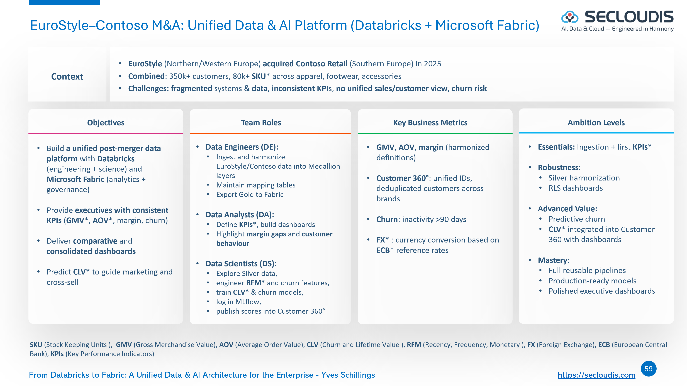
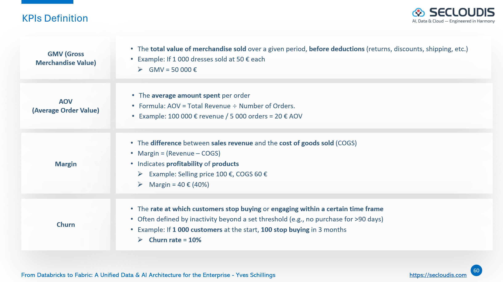

# EuroStyle–Contoso M&A – Unified Data & AI Platform with Databricks & Microsoft Fabric

This case shows how Databricks and Microsoft Fabric can unify two retailers' fragmented systems into a single, governed, and AI-driven platform, giving executives consistent KPIs, real-time dashboards, and predictive insights after a complex M&A.

## Business Context

In 2025, EuroStyle (Northern Europe) acquired Contoso Retail (Southern Europe).  
Together they serve **350k+ customers** and manage **80k+ SKUs** across apparel, footwear, and accessories.  

The merger created both opportunities and challenges:  
- **Data fragmentation**: two separate systems (files, ERPs, CRMs) must be consolidated.  
- **Inconsistent KPIs**: Gross Merchandise Value (GMV), Average Order Value (AOV), margin, and return rates are defined differently, creating confusion at board level.  
- **Post-merger visibility gap**: leaders need both **comparative views** (EuroStyle vs Contoso) and a **unified Customer 360**.  
- **Churn risk & cannibalization**: overlapping customers and product lines increase churn risk.  

To address this, the CMO and CDAO asked the **Data Engineer**, **Data Scientist**, and **Data Business Analyst** teams to deliver a **prototype platform** combining **Databricks** and **Microsoft Fabric**:

- **Databricks**: ingestion pipelines, Medallion architecture (Bronze/Silver/Gold), schema harmonization, feature engineering, MLflow for model tracking.  
- **Fabric**: Lakehouse, semantic models, Power BI dashboards with Direct Lake for executives and marketing.  
 - **Integration**: OneLake shortcuts (zero-copy) preferred; otherwise Parquet + manifest with Fabric Data Pipelines. Supports Direct Lake and CI/CD.
 - **Profiles**: DE (Medallion + handover), DS (EDA→churn/CLV + scoring), Data Business Analyst (Fabric/Power BI, RLS, dashboards).
 

---

## Project Objectives

- **Data Engineering (Databricks)**: Build reproducible Medallion pipelines, harmonize schemas, create unified Gold marts, export to Fabric Lakehouse.  
- **Data Analytics (Fabric/Power BI)**: Deliver comparative dashboards (EuroStyle vs Contoso) and unified post-merger dashboards with RLS.  
- **Data Science (Databricks MLflow)**: Train churn and Customer Lifetime Value (CLV) models, publish scored datasets into Customer 360°.  

---

  

---

## Platform Context

This project targets **Azure Databricks Premium Trial** (14 days of DBUs) and **Microsoft Fabric Trial**.  
If trials aren't available, you can still follow along using Databricks Free Edition and Fabric Free (F2) with some constraints.  
Either path demonstrates the **end-to-end integration** between Databricks (pipelines, MLflow) and Fabric (Lakehouse, Direct Lake, Power BI).  

In a production environment, this would be automated and governed using:  
- **Databricks Premium/Enterprise**: Delta Live Tables, Unity Catalog, Workflows, Jobs.  
- **OneLake Shortcuts (to ADLS Gen2 paths)**: zero-copy integration that enables Direct Lake.
- **Fabric Deployment Pipelines**: Dev/Test/Prod environments.  
- **Enterprise Security**: Managed Identity, Key Vault, Private Endpoints, RBAC.  

---

## Deliverables Journey

| Level       | Data Engineer                                                                  | Data Scientist                                                              | Data Business Analyst                                           | Governance & Quality                                                                    | Objective                 | Evidence (examples)                                                                                     |
|-------------|---------------------------------------------------------------------------------|-----------------------------------------------------------------------------|-----------------------------------------------------------------|--------------------------------------------------------------------------------------------------------|---------------------------|---------------------------------------------------------------------------------------------------------|
| Essentials  | 🟥 Bronze ingestion (landing tables, schema capture, basic constraints)        | 🟥 Churn and customer-lifetime hypotheses; quick exploration of the data    | 🟨 First-look dashboard on raw data (key indicators)            | 🟦 Define data owners; simple naming standards; initial workspace access (least privilege)             | First insights            | Bronze table list and schemas; short data-quality note; screenshot of first dashboard; access matrix    |
| Robustness  | 🟥 Silver harmonization; 🟥 Gold marts (core dimensions/facts; idempotent loads) | 🟥 Feature set: recency, frequency, monetary; overlap and consistency checks | 🟩🟨 Dashboards on Silver/Gold with draft row-level security     | 🟦 Schema contracts; before/after data-quality checks; lineage captured in Purview / Unity Catalog     | Reliable reporting        | Schema contract JSON; before/after DQ summary; Purview scan screenshot; "View as" role test; validations |
| Advanced    | 🟥 Gold marts enriched with **scored** outputs                                  | 🟥 Baseline churn and lifetime models with calibration and segment metrics   | 🟩🟨 Predictive views with small explainability highlights       | 🟦 Sensitivity labels on key assets; row-level security verified; promotion with Fabric deployment flows | Predictive insights       | Evaluation charts; metrics file; short explainability image; label screenshot; pipeline run log         |
| Mastery     | 🟥→🟩 Reusable pipelines and export to Fabric (manifest-driven, zero-copy)       | 🟥 Finalized models with monitoring (quality/drift and simple alerts)        | 🟩🟨 Executive storytelling app/report (audience & sharing set) | 🟦 Policy-as-code for permissions; lineage/audit reporting; periodic access reviews                    | Portfolio-ready prototype | Release manifest; pipeline screenshots; published app link; QA checklist; lineage report; audit extract |

**Icon legend:** 🟥 Databricks · 🟥→🟩 Databricks → Fabric integration · 🟩 Fabric · 🟨 Power BI · 🟦 Governance (Purview, Unity Catalog, labels, row-level security)

**Light glossary:**
- **Row-level security:** limits what each audience can see in reports.  
- **Recency / Frequency / Monetary:** common features summarizing customer behavior.  
- **Customer lifetime:** expected longevity/value of a customer relationship.  
- **Zero-copy (shortcuts):** reference data without duplicating it.

---

  

---

## References

- [Business Case](./statement/eurostyle-contonso-ma-business-case.md)
- [Product Backlog](./statement/eurostyle-contonso-ma-project-backlog.md)
- [Getting Started (free/trial setup)](./GETTING_STARTED.md)
- [Certification-Compliant Use Case Mapping](./statement/eurostyle-contonso-ma-certification-compliant.md)
- [Certification guides (Data Engineer / Data Scientist / Data Analyst)](./certification/)
- [Glossary](./GLOSSARY.md)

---

## Educational note (BeCode Data Analytics & AI Bootcamp)

This repository is provided solely for educational purposes as part of the BeCode Data Analytics & AI Bootcamp. Names, datasets, and scenarios are illustrative for training only and are not production guidance.

