# Runbook — Databricks and GitHub: Setup, Git Folder (Repos), Commit & Push (New UI)

## Goal

Connect Databricks to GitHub, work inside a Git folder (/Repos), then Commit & Push your notebooks.

## Requirements

- You have write access to the target GitHub repo (e.g., `<your-git-user-account>/eurostyle-contonso-ma-unified-data-ai-databricks-fabric-sol`) or to your fork.
- In your Databricks workspace, Repos (Git folders) and GitHub provider are enabled. If you don't see Repos or Linked accounts, ask a workspace admin to enable them.

## 1) Create a GitHub Personal Access Token (PAT)

1. On GitHub (signed in with the account that will push), go to Profile → Settings → Developer settings → Personal access tokens → Fine-grained tokens → Generate new token.

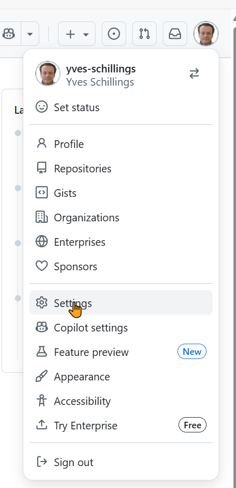  

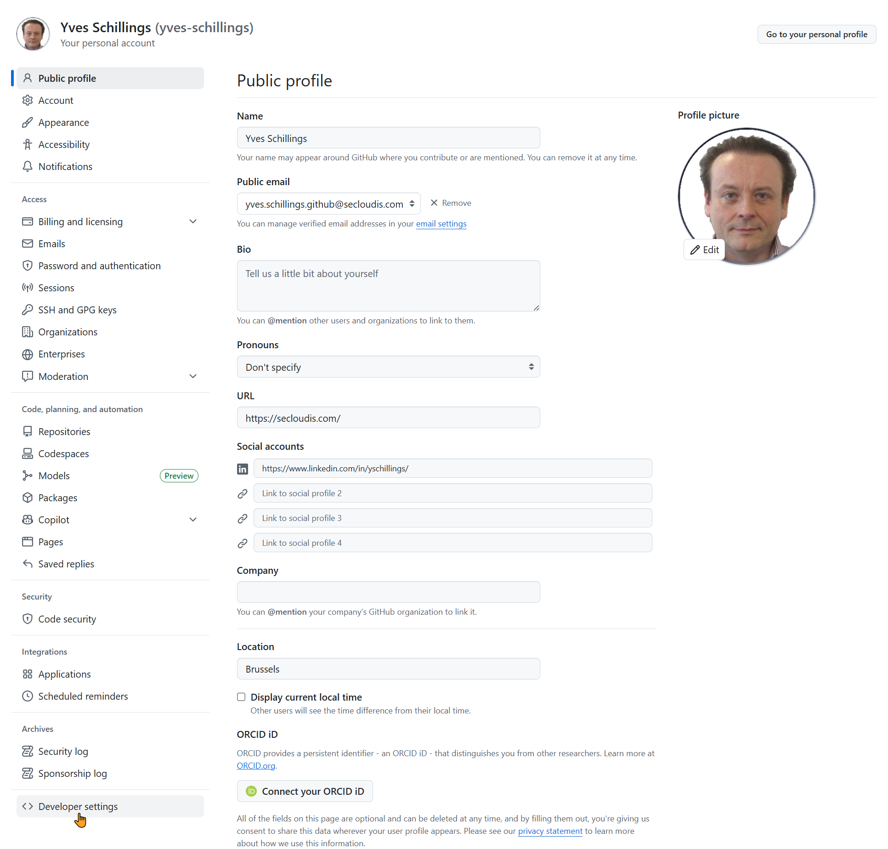  


2. Repository access: Only select repositories → select your repo.
3. Permissions (Repository permissions): set Contents: Read and write. (Optional: Pull requests: Read.)
4. Choose a name and expiration → Generate token → copy the token.
   
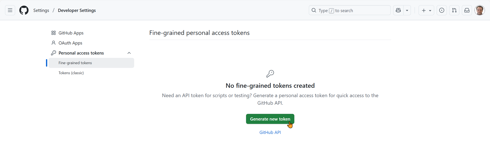  

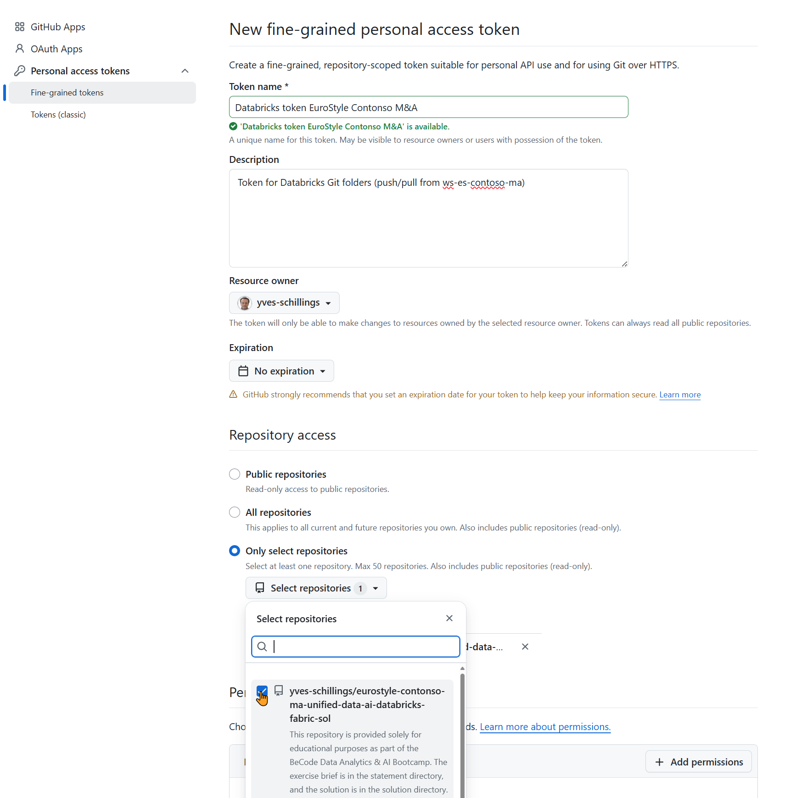  

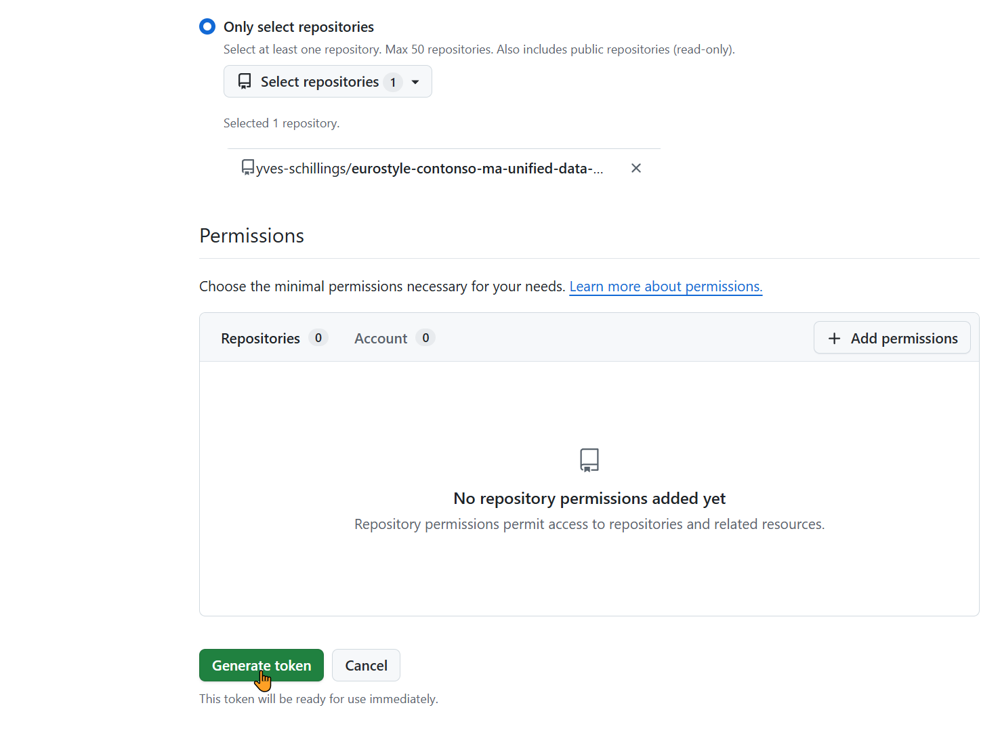  


Note: A Classic token with the single repo scope also works as an alternative.

## 2) Link GitHub in Databricks

1. In Databricks: Settings → User → Linked accounts.

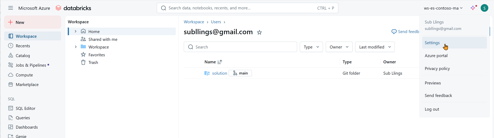  

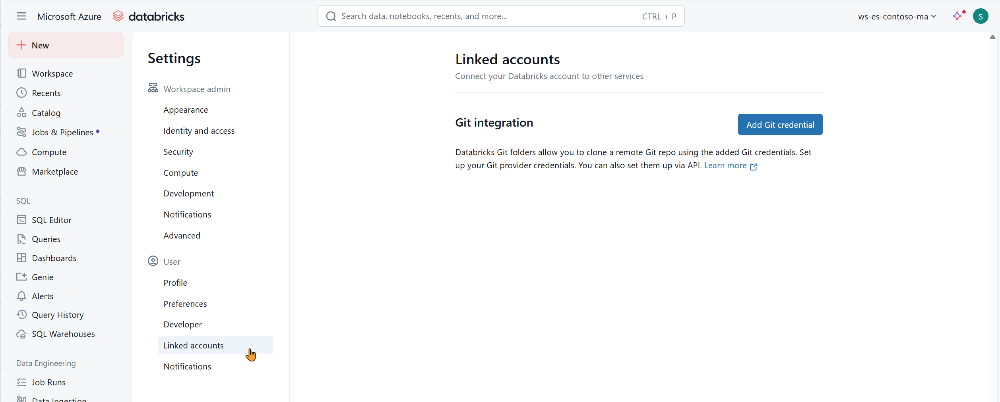  


2. Connect new → GitHub → paste the PAT → Save.

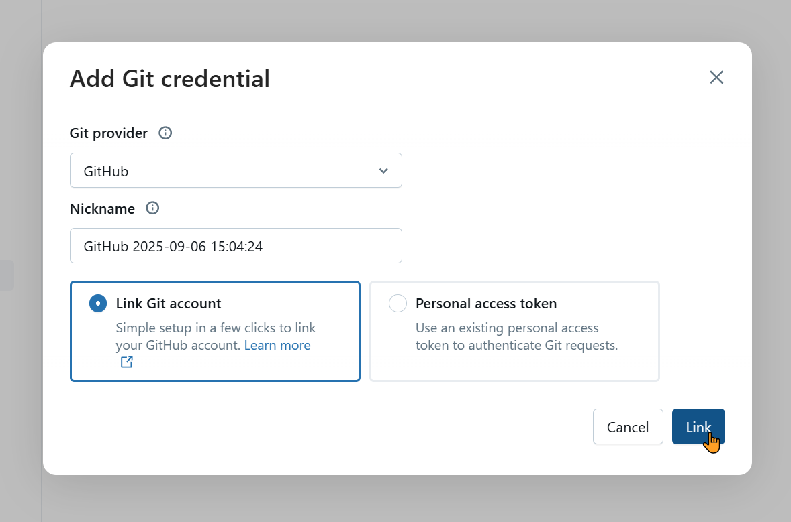  

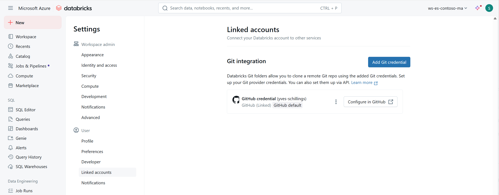  


3. If you have an old/incorrect entry, remove it first to avoid account mix-ups.

## 3) Get the repo under /Repos (Git folder creation / Clone / Convert)

Most workspaces now support "Create → Git folder" which is effectively a clone.

Method A — Create → Git folder 
1. Navigate to the target parent under `/Repos` (or your user root showing Git folders).
2. Click Create → Git folder.

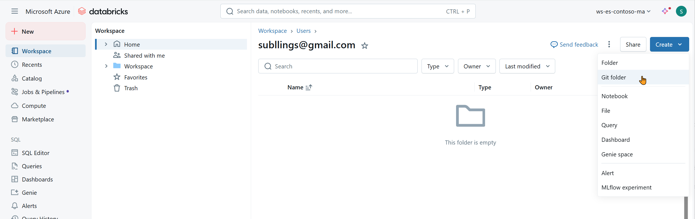  

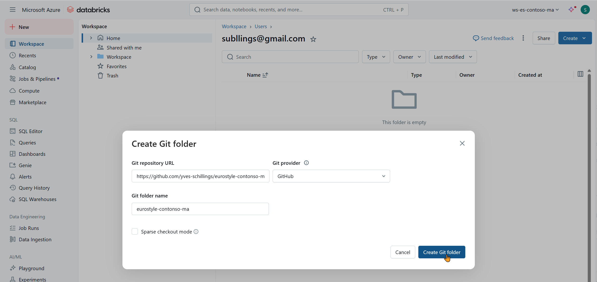  


3. Paste the HTTPS repo URL, e.g.:
  ```
  https://github.com/<your-git-user-account>/eurostyle-contonso-ma-unified-data-ai-databricks-fabric-sol.git
  ```
1. Select provider = GitHub, keep branch `main` (or choose another) → Create Git folder.
2. A Git-linked folder appears (branch badge like `main` visible). You can Stage / Commit / Push immediately.

Method B — Repos panel → Clone (older or alternate UI)
1. Left sidebar → Repos (Git folders) → Clone.
2. Paste the same HTTPS URL.
3. Choose branch → Clone. Result is identical: `/Repos/<owner>/<repo>` with Git linkage.

Method C — Convert a plain folder (only if you previously used Create → Folder, not Git folder)
1. Plain "Folder" has no branch badge and no Git actions.
2. To fix:
  - Recommended: Delete (if empty) and use Method A or B.
  - Or create a proper Git folder elsewhere and Move notebooks into it.
  - Uploading content into a plain folder does NOT add Git features.
3. If no Stage / Commit / Push buttons: you're still in a plain folder—move work to a Git folder.

Quick visual rules
- Branch badge (e.g., `main`) = Git folder.
- No badge = plain folder (not versioned; won't push).

Only Git-linked paths under `/Repos/` are under Git control. Anything in `Workspace/` or a plain folder is not.

## 4) Move your existing notebooks into the repo

1. In Workspace, right-click your folder (e.g., `Epic 1 – Data Foundation Platform`) → Move → target `/Repos/<owner>/<repo>/` (create a `solution/` subfolder if desired).

## 5) Commit & Push from Databricks

1. Open any file from `/Repos/...`.
2. Click the branch badge (e.g., `main`) or the Git icon to open the Changes panel.

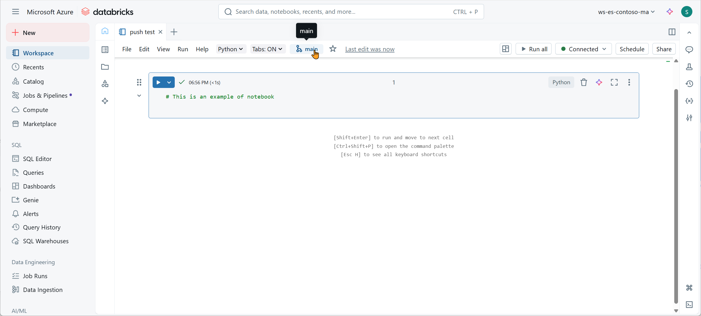  

3. Select files → Stage.
4. If prompted, Pull first.
5. Enter a commit message (e.g., `feat(epic1): initial notebooks`) → Commit & push.

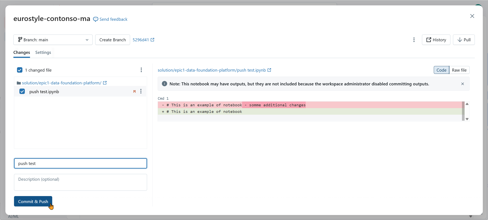  


Working on protected `main`?

- Create a branch (branch menu → Create branch, e.g., `feat/epic1`) → Commit & Push → open a Pull Request on GitHub.

Error messages that may appear if Databricks git hub app is not installed
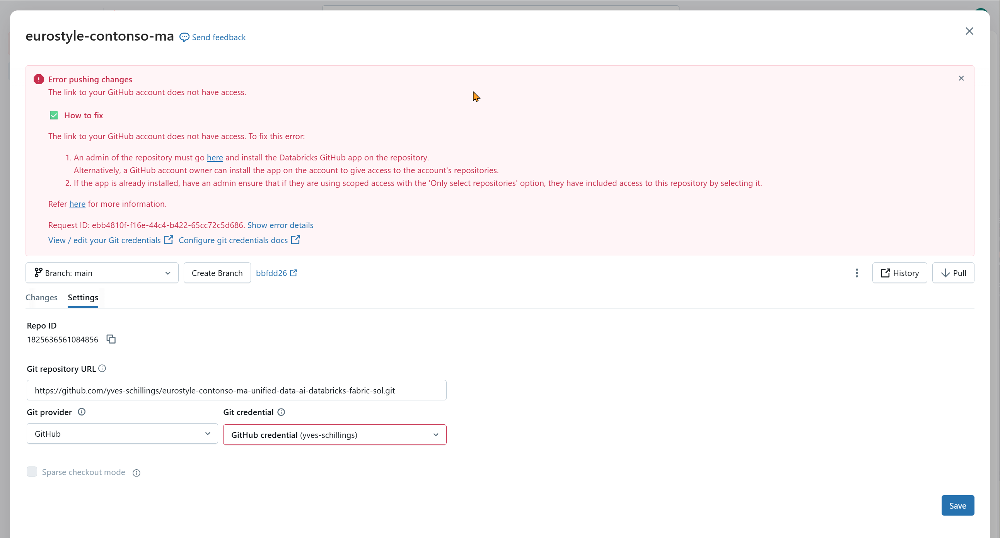  

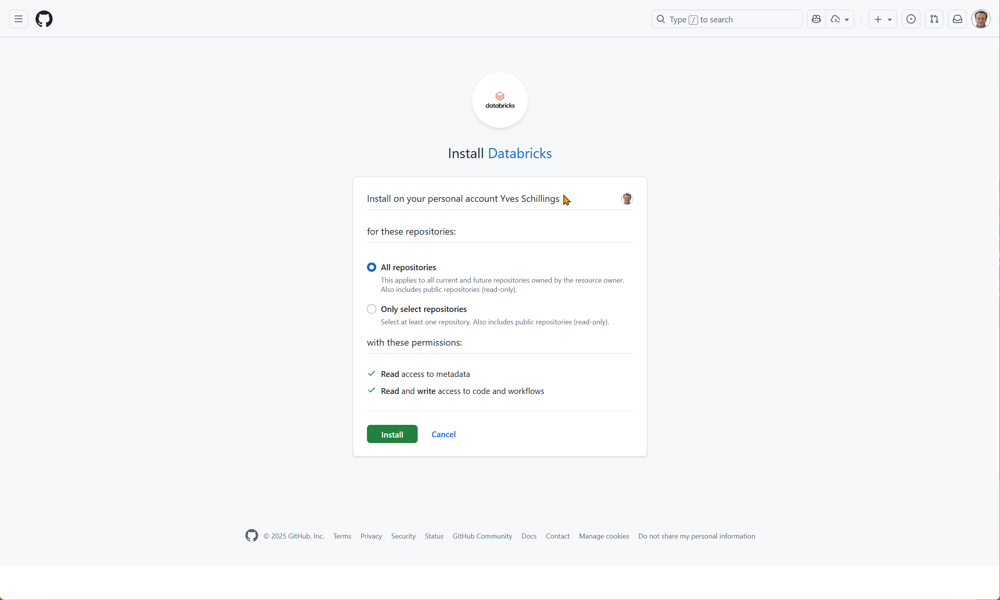  

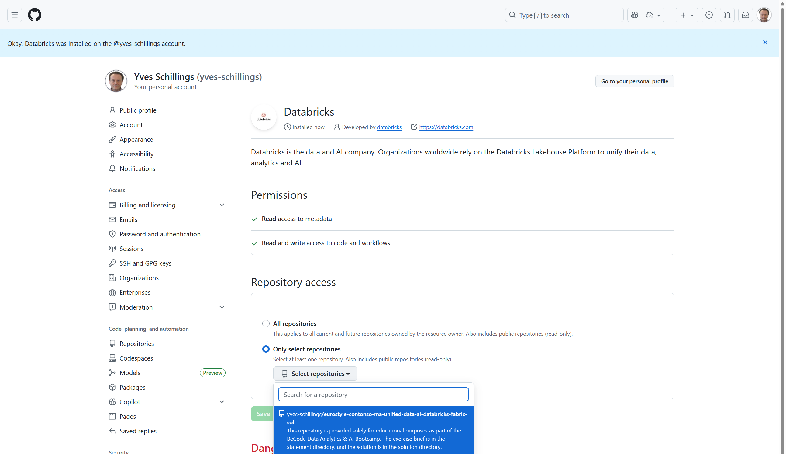  

