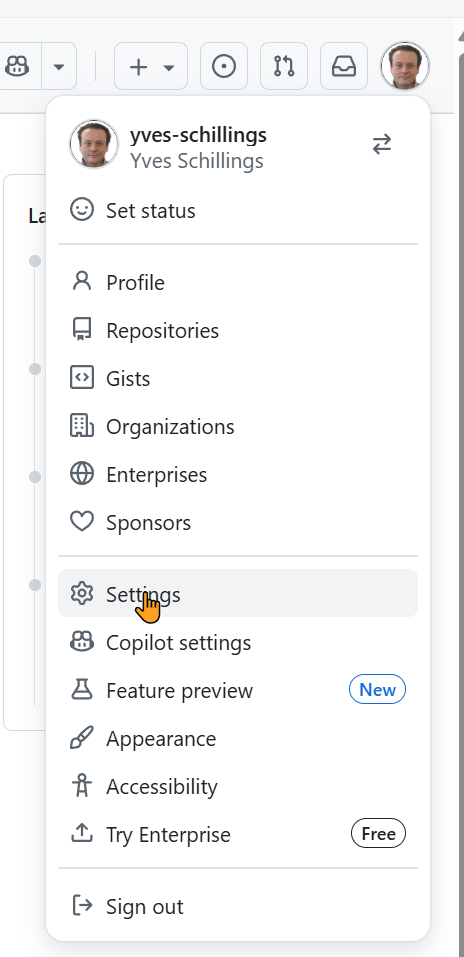
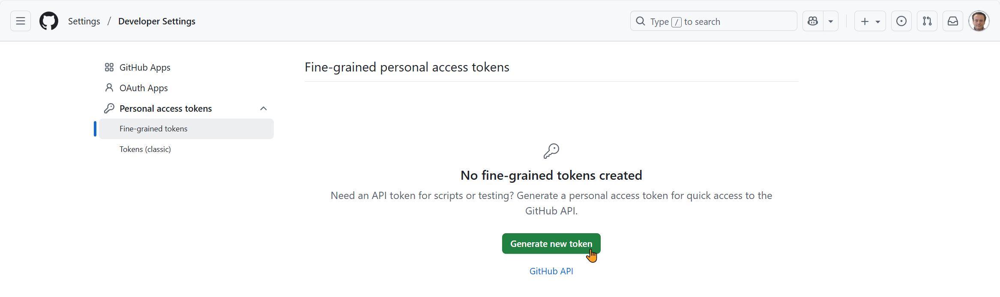
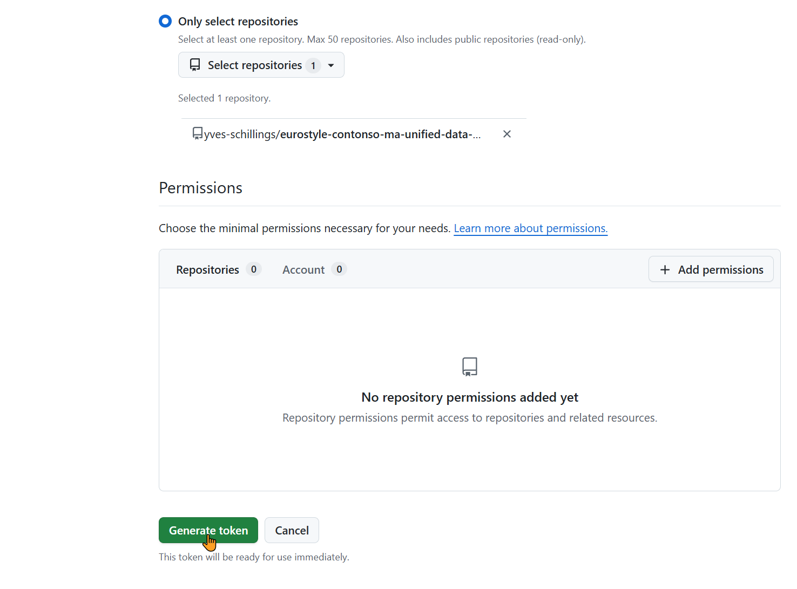
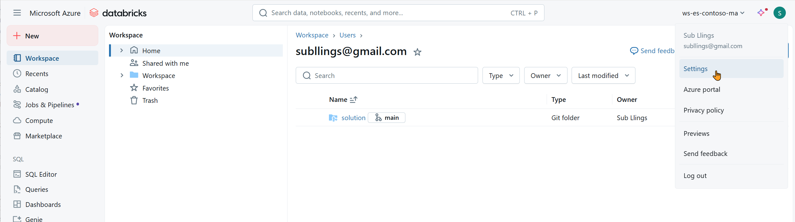
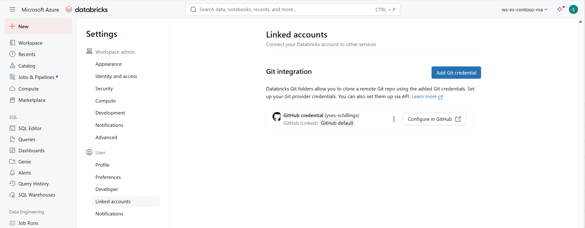

# Runbook — Push Databricks code to GitHub (new UI)

Goal

Connect Databricks to GitHub, work inside a Git folder (/Repos), then Commit & Push your notebooks.

## 0) Requirements

- You have write access to the target GitHub repo (e.g., `<your-git-user-account>/eurostyle-contonso-ma-unified-data-ai-databricks-fabric-sol`) or to your fork.
- In your Databricks workspace, Repos (Git folders) and GitHub provider are enabled. If you don't see Repos or Linked accounts, ask a workspace admin to enable them.

## 1) Create a GitHub Personal Access Token (PAT)

1. On GitHub (signed in with the account that will push), go to Profile → Settings → Developer settings → Personal access tokens → Fine-grained tokens → Generate new token.

  

  


2. Repository access: Only select repositories → select your repo.
3. Permissions (Repository permissions): set Contents: Read and write. (Optional: Pull requests: Read.)
4. Choose a name and expiration → Generate token → copy the token.
   
  

  

  


Note: A Classic token with the single repo scope also works as an alternative.

## 2) Link GitHub in Databricks

1. In Databricks: Settings → User → Linked accounts.

  

  


2. Connect new → GitHub → paste the PAT → Save.

  

  


3. If you have an old/incorrect entry, remove it first to avoid account mix-ups.

## 3) Clone the repo into Repos

1. Left sidebar → Repos (or Git folders) → Clone.
2. Paste the HTTPS repo URL, e.g.:

```
https://github.com/<your-git-user-account>/eurostyle-contonso-ma-unified-data-ai-databricks-fabric-sol.git
```

3. Branch: `main` → Clone.
4. You now have a path like `/Repos/<owner>/<repo>`.

Only items under `/Repos/` are under Git control. Anything under `Workspace/` is not.

## 4) Move your existing notebooks into the repo

1. In Workspace, right-click your folder (e.g., `Epic 1 – Data Foundation Platform`) → Move → target `/Repos/<owner>/<repo>/` (create a `solution/` subfolder if desired).

## 5) Commit & Push from Databricks

1. Open any file from `/Repos/...`.
2. Click the branch badge (e.g., `main`) or the Git icon to open the Changes panel.
3. Select files → Stage.
4. If prompted, Pull first.
5. Enter a commit message (e.g., `feat(epic1): initial notebooks`) → Commit & push.

Working on protected `main`?

- Create a branch (branch menu → Create branch, e.g., `feat/epic1`) → Commit & Push → open a Pull Request on GitHub.

## 6) Multiple accounts (common cases)

- Want to push to `<your-git-user-account>/...` → the PAT in Linked accounts must belong to `<your-git-user-account>`.
- Want to keep using your account → clone your fork, push there, then open a PR to the original repo.

## 7) Quick troubleshooting

- 403 "denied to <username>" → the stored PAT belongs to the wrong GitHub account.
  - Fix: In Settings → User → Linked accounts, delete the entry and add a PAT from the correct account (or push to your fork).
- No Commit/Push buttons → you're editing under `Workspace/`, not `/Repos/`. Open files from `/Repos`.
- Cannot see Repos / Linked accounts → ask an admin to enable Git folders and the GitHub provider in Workspace admin → Workspace settings.
- Databricks UI glitch (azurefd.net assets) → sign out/in, hard refresh (Ctrl+F5), try a private window, or clear site data for the workspace domain.

## 8) One-minute checklist

- [ ] PAT created on the right GitHub account with Contents: Read & write
- [ ] PAT saved in Databricks → Settings → User → Linked accounts → GitHub
- [ ] Repo cloned under `/Repos` (not `Workspace`)
- [ ] Notebooks moved into `/Repos/...`
- [ ] Stage → Commit → Push (or branch → PR)

## Tips

- Add a short entry in the repo root `README.md` linking to the runbook so contributors can find it quickly.
- If your organization uses an internal docs site, mirror the runbook there and include the repo link.
- For sensitive organizations: store PATs in a secure secret store—never commit them.

---

File created: `docs/runbooks/push-databricks-to-github.md`
